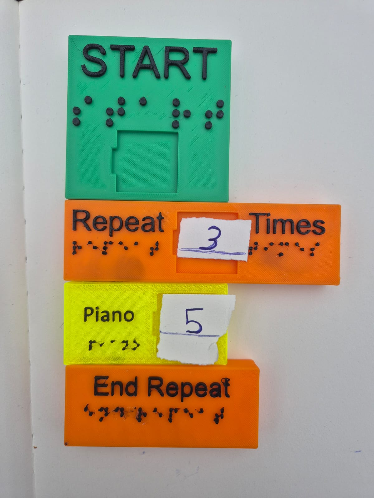

# TactiCode

This is the unified repository for **TactiCode**.

TactiCode is an accessible, tactile-first coding system designed for visually impaired learners.  
It combines physical 3D-printed Braille coding blocks with a Flutter-based interpreter app to teach programming through touch and sound.

---

## Architecture

This project uses a hybrid physical–digital architecture.

Learners build logical sequences using tactile blocks, and the Flutter app interprets these sequences to produce audio or spoken output.  
This allows learners to understand programming flow through multisensory feedback.

Communication between physical and digital components occurs via:
- Manual block input or scanning  
- Logical interpretation inside the Flutter app  
- Audio playback or text-to-speech output

---

## Hardware

The tactile system consists of 3D-printed Braille blocks:
- Start and End control blocks  
- Repeat and Times looping blocks  
- Action blocks such as Guitar or Drum  

Each block includes raised text, Braille labeling, and high-contrast colors.

---

## Flutter App

The digital component interprets tactile sequences and provides:
- Logical parsing of block order and relationships  
- Sound and voice feedback to represent program execution  
- Accessible interface for both learners and educators  

---

## HTML Audio Interpreter

An additional component of this project is a **web-based audio interpreter** implemented in `index.html`.  
This module provides an accessible way to visualize and play tactile programs directly in the browser using **Tone.js**.  

### Features
- Renders visual representations of tactile code blocks  
- Plays audio feedback using virtual instruments (Drums, Piano, Guitar)  
- Displays status messages and error suggestions  
- Handles JSON-based program structures sent from the Flutter app  

### Structure
- **UI Elements:** Status indicator, block list, and Play button  
- **Logic:**  
  - Parses JSON input received from the Flutter app  
  - Builds block representations dynamically  
  - Schedules audio events based on block sequences  
- **Audio Engine:** Powered by Tone.js for browser-based sound synthesis  
- **Error Handling:** Displays contextual suggestions in pop-up notifications  

This HTML page (`index.html`) serves as the **browser interface** for testing the TactiCode logic and ensuring consistent audio behavior across platforms.

---

## Features

- Braille-labeled and color-differentiated block system  
- Teaches loops, sequencing, and repetition  
- Combines tactile, visual, and auditory learning  
- Cross-platform Flutter app (Android, iOS, Web)  
- Designed for inclusive and collaborative education  

---

## Development Stack

**App:**
- Flutter  
- Dart  
- AudioPlayers or equivalent  
- Material Design  

**Hardware:**
- 3D-printed PLA blocks  
- Braille-compliant geometry and texture design  

**Web:**
- HTML5  
- CSS  
- JavaScript (Tone.js)  

---

## Image

